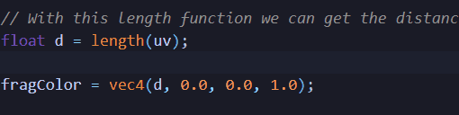

# Shortcuts
Here contains all my shortcuts for editing code.  
(L) leader

(L) e -> Toggle File Explorer  
(L) E -> Toggle File Explorer focus  
(L) q -> Close Tab (Ctrl L q if preview)  
(L) y -> Copy register 0 to +
Ctrl L -> Go to right Tab
Ctrl H -> Go to left Tab
Ctrl Shift L -> Move Right Tab
Ctrl Shift H -> Move Left Tab
Ctrl ' -> Terminal

## Not used too often but useful
Ctrl Alt -> Show inline hints

